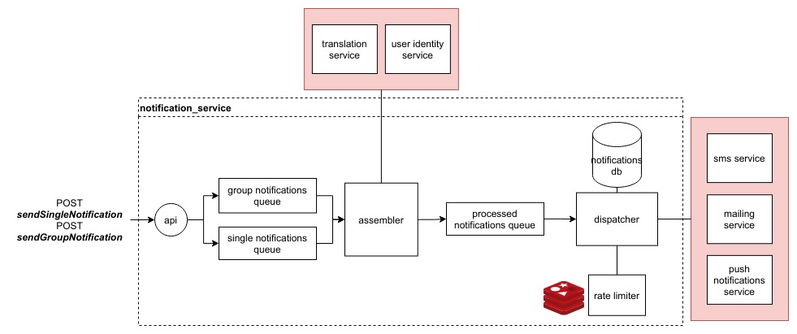

# notification-service
# System Architecture


**note**: notifications are not persisted in the current implementation yet

## breakdown
- api: an http server that only serve requests and pushes requests in the processing queues
- assembler: a worker that assembles the notifications
  - for personalized notification, it:
    1. fetches the appropriate user attributes and replace any placeholders in the template
    2. translates the content according to the user's current locale
    3. retrieves the appropriate target data according to the notification method
  - for group notifications, it:
    1. retrieves the appropriate target data for each user in the group
    2. breaks down the request into batches to minimize payload size
- dispatcher: a worker that integrates with third party services and routes the notifications accordingly, it is self rate limited by utilizing redis

# How to run

Run `docker-compose up -d`

# Docs
- /`sendSingleNotification`
```
body:
{
    "user_id": "1",
    "method":"sms",
    "content": "Hi %name%, you destination is near!",
    "personalization_tags":["name"]
}
```
`content` can contain tags surrounded by '%' reflecting fields in the `personalization_tags` array to be interpolated later

- /`sendSingleNotification`
```
body:
{
    "group_id": "1",
    "method":"push_notification",
    "content": "Hello there!"
}
```

# Schema assumptions
The service is minimal and doesn't need direct access to any of the data, only the needed personalization fields, user locale and groups

- User
1. user_id
2. name
3. email
4. mobile_number (for sms)
5. device_token (for push notifications service)
6. locale (for language setting)

- Group
1. group_id
2. users_ids

# Scalability 
Each worker service has a concurrency pool size that can be configured (current default is 1 assembler and 5 dispatchers).
Each worker is stateless so they can be replicated on multiple containers through an orchestrator.

# TODO
- Write unit tests for the common code and rate limiter
- Write a more dynamic adn generic rate limiter to be easily used with any external service
- Write a data persistance layer and expose read endpoints for notifications
- Generate Notification IDs from a distributed data store instead of using UUIDs
- Check against invalid requests (check for missing fields, invalid users..etc)